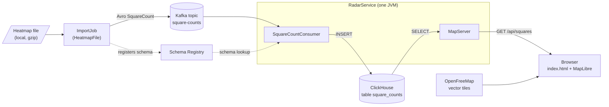

# Architecture

State after slice 1 (`slice-1-one-file`): one local heatmap file goes through Kafka into ClickHouse, and a web page shows the aircraft count of each 1° square. The plan is in [walking-skeleton.md](walking-skeleton.md).

The import job counts the records of each 1° square and sends one message per square. It does not read the ICAO code yet (slice 2). The consumer in `RadarService` writes the messages to ClickHouse. `MapServer` serves the page, MapLibre, and the squares as JSON. The browser loads the map tiles from OpenFreeMap.

| Part | Code | Role |
|---|---|---|
| Import job | [ImportJob.java](../src/main/java/io/github/corioliskraft/doomsdayradar/ImportJob.java), [HeatmapFile.java](../src/main/java/io/github/corioliskraft/doomsdayradar/HeatmapFile.java) | Reads one file and counts the records per 1° square. Registers the Avro schema and sends the counts. |
| Kafka and Schema Registry | [square_count.avsc](../src/main/avro/square_count.avsc) | Topic `square-counts` (1 partition). The registry holds the schema of `SquareCount`. |
| Consumer | [SquareCountConsumer.java](../src/main/java/io/github/corioliskraft/doomsdayradar/SquareCountConsumer.java) | Creates the topic and the table. Inserts each batch into ClickHouse, then commits the offset. |
| ClickHouse | [Tables.java](../src/main/java/io/github/corioliskraft/doomsdayradar/Tables.java) | Table `square_counts` (latitude, longitude, aircraft). |
| Map server | [MapServer.java](../src/main/java/io/github/corioliskraft/doomsdayradar/MapServer.java), [index.html](../src/main/resources/web/index.html) | Serves the page, the MapLibre files, and `GET /api/squares`. |

Docker containers exist only in the tests ([RadarContainers.java](../src/test/java/io/github/corioliskraft/doomsdayradar/RadarContainers.java)). The project has no `main` class and no Docker Compose file yet.
